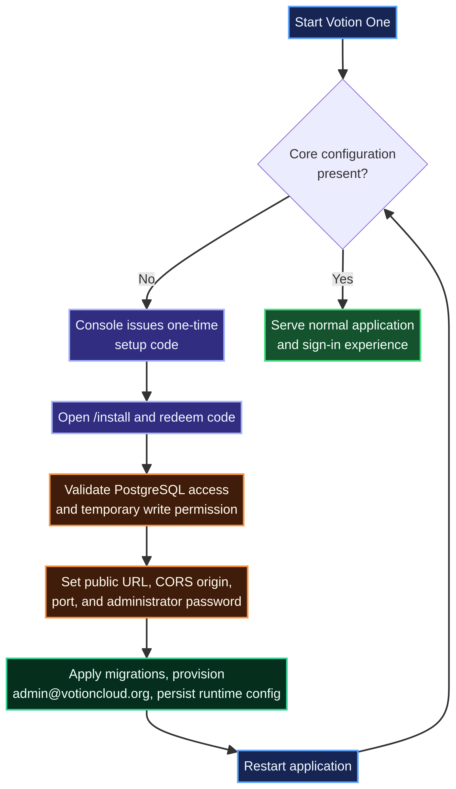

<p align="center">
  
</p>

<h1 align="center">Votion One™</h1>

<p align="center">
  <strong>The operating system for modern virtual infrastructure.</strong><br />
  A database-first control plane for Proxmox VE fleets, customer operations, billing, service delivery, and secure day-two management.
</p>

<p align="center">
  
  
  
  
  
</p>

<p align="center">
  <a href="#why-votion-one">Why Votion One</a> ·
  <a href="#first-run-installation">Install</a> ·
  <a href="#architecture">Architecture</a> ·
  <a href="#operations">Operations</a> ·
  <a href="#deployment">Deploy</a> ·
  <a href="#security-model">Security</a>
</p>

---

## Why Votion One

Votion One™ brings the operations that normally live across a hypervisor UI, spreadsheets, billing tools, inboxes, and ad-hoc administrative scripts into a single accountable workspace. It is built for operators who need clear ownership, trustworthy historical data, controlled infrastructure actions, and a polished experience for both administrators and clients.

The platform is **database-first**: operational records are retained in PostgreSQL, while only deployment bootstrap settings and encryption material remain in a protected runtime volume. Proxmox remains the system of record for live infrastructure; Votion One provides the workflow, data model, auditability, and customer experience around it.

| Domain | What Votion One provides | Intended user |
| --- | --- | --- |
| **Fleet control** | Multi-connection inventory, VM lifecycle actions, allocation visibility, metadata, firewall, backup, and snapshot workflows | Administrators and operators |
| **Observability** | Database-backed inventory, telemetry history, operational status, alerts, and node-level context | Administrators and operators |
| **Service delivery** | Client workspace, assigned server visibility, secure console access, support, and self-service actions | Clients |
| **Support operations** | Ticket inbox, ownership, priority, message history, and an auditable service record | Clients and administrators |
| **Commercial operations** | Plans, billing assignments, invoices, costs, capacity context, and unit-economics visibility | Administrators and finance operators |
| **Change control** | Approval-aware reimage requests, operator execution steps, audit trails, and guarded infrastructure actions | Administrators and operators |

> **Design principle:** Votion One uses an editorial hierarchy for product identity and a compact operational interface for everything that must be scanned, acted upon, or audited quickly.

## Core capabilities

| Capability | Operational value |
| --- | --- |
| **Infrastructure, without the noise** | Manage Proxmox-connected virtual machines through a purpose-built interface for state, capacity, ownership, credentials, lifecycle actions, firewall policies, backups, snapshots, and web console workflows. |
| **Database-first operational context** | Persist inventory, VM metrics, support work, billing records, alerts, automations, audit events, and account information in PostgreSQL for resilient dashboards and historical reporting. |
| **Enterprise service workflow** | Run client support through dedicated workspaces, clearly assigned queues, priority and status controls, threaded replies, notification context, and administrator visibility. |
| **Operator safeguards** | Separate requests from execution, keep privileged actions behind authenticated administration, and preserve explicit audit history for configuration and lifecycle work. |

## Architecture

<p align="center">
  
</p>

The browser workspace is a React application built with Vite. An Express application API provides authentication, role-aware workflows, Proxmox integration, console relay functionality, mail integration, automation, and database-backed service operations. PostgreSQL stores durable application data; protected runtime configuration stores only the values necessary to bootstrap and secure the deployment.

The editable Mermaid source for the diagram is available at [`docs/architecture.mmd`](docs/architecture.mmd).

### Persistence boundary

| Storage boundary | Contents | Backup and operational implication |
| --- | --- | --- |
| **PostgreSQL** | Accounts, roles, VM and node records, telemetry, tickets, billing data, assignments, audit history, automation state, and operational configuration | Back up as the authoritative application dataset. |
| **Protected runtime volume** | Database bootstrap URL, session-signing secret, public URL, CORS origins, selected port, installation timestamp, and the Proxmox credential-encryption key | Persist this volume separately. Losing it does not delete PostgreSQL records, but can prevent startup or credential decryption. |
| **Proxmox VE** | Live hypervisor state and infrastructure operations | Remains the live provider system of record. Configure and operate it according to your Proxmox controls. |
| **Browser storage** | Short-lived session and user-interface convenience state | Not a source of business data. Clearing browser data may sign a user out or reset preferences. |

## Technology foundation

| Layer | Technology | Role |
| --- | --- | --- |
| Client | React 18, TypeScript, React Router, Tailwind utilities | Responsive role-aware workspace and URL-driven application routes |
| Server | Node.js, Express 5, TypeScript | API, authentication, validation, workflow coordination, proxying, and static application serving |
| Data | PostgreSQL and `pg` | Durable application data, migrations, telemetry, service operations, and reporting records |
| Virtualization | Proxmox VE API, noVNC-compatible relay | VM inventory, lifecycle actions, console access, live provider interaction, and metadata retrieval |
| Messaging | Optional SMTP via Nodemailer | Transactional notifications and optional registration OTP flows |
| Visualization | Recharts, Three.js ecosystem, custom interface primitives | Operational charts and restrained visual context where it serves the workflow |

---

## First-run installation

A new Votion One deployment starts in a guarded installer mode rather than assuming secrets or database details already exist. It is designed for a first launch on a developer machine, VM, container, or managed game-panel deployment.

<p align="center">
  
</p>

The editable Mermaid source for this diagram is available at [`docs/installation-flow.mmd`](docs/installation-flow.mmd).

### Installation workflow

1. Build and start the application using `npm run build` followed by `npm start`.
2. The installer prints a **one-time setup code** to the server console. The code is never embedded in a browser URL.
3. Open `/install`, enter the code, and establish a short-lived protected browser session.
4. Enter and validate the PostgreSQL connection. Validation performs a lightweight read check and a temporary transaction-scoped write-permission probe.
5. Set the public application URL, trusted browser origins, application port, and the first administrator password.
6. Complete the installation. Votion One applies migrations, provisions or promotes `admin@votioncloud.org`, and writes protected bootstrap configuration.
7. Restart once. The application then starts in normal mode and serves the standard sign-in experience.

> **Important:** Completing installation changes the selected database and runtime volume. Use a database you are authorized to initialize, and maintain backups before making irreversible deployment changes.

### Quick start

```bash
# Clone the repository and install dependencies
npm install

# Build the browser bundle and type-check client and server code
npm run build

# Start Votion One
npm start
```

For a fresh deployment, open the local address reported by the server and use the one-time console code at:

```text
http://localhost:5000/install
```

For local development with the development launcher:

```bash
npm run dev
```

### Installation inputs

| Installer input | Purpose | Guidance |
| --- | --- | --- |
| **PostgreSQL connection URL** | Connects Votion One to its durable application database | Use a dedicated database and least-privilege database account with migration rights. |
| **Public application URL** | Establishes the canonical browser-facing address | Use your externally reachable HTTPS address in production. |
| **Trusted browser origins** | Controls allowed browser origins for API access | Use a comma-separated allowlist only for origins you operate. |
| **Application port** | Sets the application port saved for subsequent starts | Use the local or container port. A deployment-supplied `PORT` value overrides it. |
| **Administrator display name** | Identifies the initial administrator | The initial administrator email is reserved as `admin@votioncloud.org`. |
| **Administrator password** | Secures the initial administrator account | Use a unique password of at least 12 characters and protect it with your password manager. |

## Deployment

Votion One can run as a single Node.js process after a production build. The normal server serves both the application API and the built single-page application, which is suitable for managed deployment environments that expose one application port.

### Required production posture

| Requirement | Recommended deployment decision |
| --- | --- |
| **Node.js runtime** | Use a current supported Node.js LTS release. |
| **PostgreSQL** | Use a persistent PostgreSQL service with an independent backup policy. |
| **Persistent runtime volume** | Persist `.runtime` or set `RUNTIME_SECRETS_DIR` to a writable persistent mount. |
| **TLS** | Terminate HTTPS at a trusted reverse proxy or platform edge. Keep the application’s public URL on HTTPS. |
| **Port allocation** | Set `PORT` from the hosting platform when it assigns the external/container port. |
| **Build artifact** | Run `npm run build` before `npm start`; preserve the generated `dist` directory in the deployed release. |
| **Proxmox connectivity** | Make the Proxmox API reachable only through expected network paths and use TLS verification or a verified certificate fingerprint. |

### Runtime configuration and precedence

After a successful installation, Votion One writes protected deployment bootstrap values to the runtime volume. The following runtime values are expected to be persistent, private, and never committed to Git.

| Variable | Purpose | Precedence |
| --- | --- | --- |
| `DATABASE_URL` | PostgreSQL connection string | Deployment environment overrides the protected runtime value. |
| `TOKEN_SECRET` | Server session-signing secret | Deployment environment overrides the protected runtime value. Use at least 32 characters. |
| `PUBLIC_APP_URL` | Canonical browser-facing URL | Deployment environment overrides the protected runtime value. |
| `CORS_ORIGINS` | Comma-separated trusted browser origins | Deployment environment overrides the protected runtime value. |
| `PORT` | Node.js listening port | Deployment environment overrides the installer-saved port. |
| `RUNTIME_SECRETS_DIR` | Alternate location for protected runtime configuration | Set this when the working directory is not persistent. |
| `INSTALLER_PUBLIC_URL` | Optional externally reachable installer base URL | Use only when the server console needs to direct an operator to a different reachable host. |

### Pterodactyl deployment notes

When deploying through Pterodactyl, retain a writable persistent directory for `RUNTIME_SECRETS_DIR`, expose the panel-assigned `PORT`, and build the application before first start. The server console displays the one-time setup code; the operator should enter it locally at the installer route rather than sharing it through tickets, chat, screenshots, or public logs.

A concise startup command is:

```bash
npm start
```

If your egg requires an explicit build step, use:

```bash
npm ci
npm run build
npm start
```

---

## Operations

### Administrator and client workspaces

| Workspace | Operational focus |
| --- | --- |
| **Administrator** | Proxmox connections, inventory, assignments, alerting, automation, billing operations, support queues, reimage approvals, audit logs, system configuration, and user management |
| **Client** | Assigned services, actionable service state, support requests, secure assistance, account settings, invoices and service context |
| **Operator execution** | Approved reimage work and provider actions, separated from customer request creation for traceability and safety |

### Support and service operations

The support workspace is designed as an operational inbox, not just a message form. Client requests can be categorized and prioritized; administrators can assign ownership, update status, retain reply history, and monitor unassigned or urgent work. The client interface uses customer-facing service language rather than exposing unnecessary provider terminology.

### Telemetry and database-first inventory

The server includes a Proxmox synchronization service and database-backed VM and metrics records. This lets dashboards and commercial operations query durable local state, while privileged or real-time provider interactions continue to be performed against configured Proxmox connections. A missing or disabled provider connection should not be represented as missing historical database data.

### Billing and commercial visibility

The billing workspace supports plan and pricing management, VM assignment, invoicing, cost bases, suspension workflow context, and node-level unit economics. It is intended to support operational profitability analysis, not substitute for statutory accounting or tax advice.

### Reimage workflow

Reimage requests are intentionally separated into request, approval, and operator execution stages. Approval by itself does not perform a Proxmox action. This boundary gives operators the opportunity to verify scope and customer authorization before running a destructive provider operation.

## Security model

Votion One is designed to avoid putting long-lived infrastructure credentials or installation authorization in public routes.

| Control | Implementation approach |
| --- | --- |
| **First-run access** | A random one-time console code with a 30-minute lifetime establishes an `HttpOnly`, `SameSite=Strict` installer session. |
| **Bootstrap secrets** | The installer creates a server secret when one is not supplied and stores it only in protected runtime configuration. |
| **Provider credentials** | Proxmox credentials are encrypted for storage. The encryption key is stored outside PostgreSQL in the protected runtime volume. |
| **Role boundaries** | Administrative and operator workflows are restricted to the appropriate authenticated roles. |
| **Database validation** | A connection test checks reachability and temporary write permission before running migrations. |
| **Protected configuration** | The runtime directory and installation file are created with restrictive permissions where the host operating system supports them. |
| **CORS** | Installation captures the trusted browser origin list; production deployment should use explicit origins rather than broad allowances. |
| **Auditability** | Operational workflows are designed to retain relevant database-backed context and history. |

> Treat the server console code, database URL, `TOKEN_SECRET`, runtime files, backups, and encryption keys as sensitive operational material. Do not commit, paste, or attach them to issues.

## Validation and maintenance

| Command | Purpose |
| --- | --- |
| `npm run build` | Runs strict client and server type checks, then produces the production browser build. |
| `npm run dev` | Starts the development launcher. |
| `npm run server` | Starts the installer-aware server entry point. |
| `npm start` | Starts the installer-aware server entry point for normal deployment. |
| `npm run migrate` | Runs the migration command in an already configured environment. |
| `npm run db:verify` | Verifies expected database schema conditions in a configured environment. |
| `npm run db:verify:fresh` | Validates fresh database initialization behavior. |

### Health checks

Before installation, use:

```text
GET /healthz
```

The installer returns its status and whether a setup session is available. After installation and restart, use:

```text
GET /api/v1/health
```

A healthy normal application response confirms the service and database connectivity. The normal application’s root route serves the React application and redirects an unauthenticated visitor to the sign-in route.

### Troubleshooting

| Symptom | What to check |
| --- | --- |
| Installer does not start | Confirm `DATABASE_URL` and `TOKEN_SECRET` are not partially set in a conflicting environment, then verify the process can write to `RUNTIME_SECRETS_DIR`. |
| Setup code is unavailable | Restart the installer to issue a fresh code, then use the newest code from the active server console within 30 minutes. |
| Application keeps returning to installation mode | Confirm the protected runtime volume survives restarts and contains the values saved after successful installation. |
| Normal API works but the root page is unavailable | Run `npm run build`, then start with `npm start`; normal mode serves the generated `dist` application bundle. |
| Database validation fails | Confirm the PostgreSQL URL, network path, credentials, target database, and schema-write privileges. |
| Provider operations are paused | Confirm a Proxmox connection is configured, reachable, and has the required credentials and verified TLS configuration. |
| Existing provider credentials stop decrypting | Restore the same protected runtime encryption key. Do not replace it while encrypted provider records exist. |

## Contributing and change discipline

This repository uses a disciplined delivery model so individual changes can be reviewed, reverted, and deployed safely.

1. Work in focused changes that preserve the existing design system and architecture.
2. Run `npm run build` before committing.
3. Use an atomic Conventional Commit message such as `feat: add connection health overview` or `fix: serve frontend from normal application server`.
4. Push validated commits to `origin/main`.
5. Undo a published change with `git revert <commit>` and push the resulting revert rather than rewriting branch history.

```bash
# Example safe rollback
git revert <commit-sha>
git push origin main
```

## Repository layout

```text
.
├── src/                    # React application, UI primitives, and URL-driven routes
├── server/                 # Express API, database layer, jobs, providers, and workflow services
│   ├── db/                 # PostgreSQL schema, migrations, and verification scripts
│   ├── jobs/               # Scheduled operational workloads
│   ├── routes/             # Authenticated API domains and role-aware endpoints
│   └── services/           # Proxmox, database health, mail, runtime config, reporting, and security services
├── docs/
│   ├── assets/             # README visual assets
│   ├── architecture.mmd    # Editable system architecture diagram
│   └── installation-flow.mmd # Editable first-run lifecycle diagram
├── scripts/                # Local development launcher and support scripts
└── dist/                   # Generated production browser bundle (created by npm run build)
```

## Repository status

This repository is intended for private operation and controlled deployment. Before granting source access, verify that the recipient is authorized to handle deployment configuration, database backups, and infrastructure-related operational context.

---

<p align="center">
  <strong>Votion One™</strong><br />
  <sub>Clear control for critical infrastructure.</sub>
</p>
