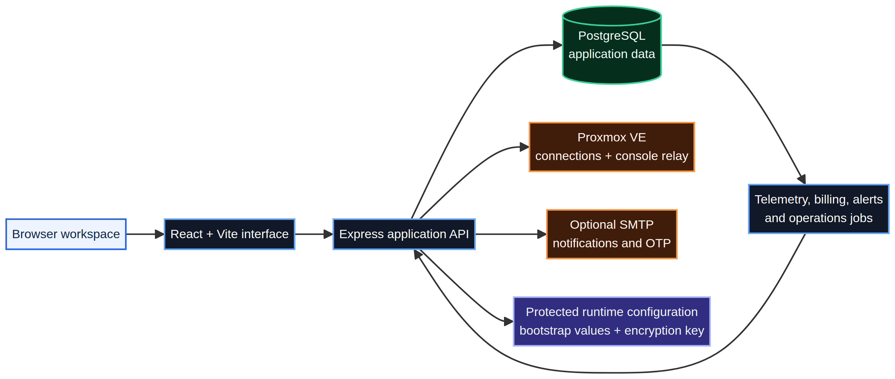

<p align="center">
  
</p>

<h1 align="center">Votion One™</h1>

<p align="center">
  <strong>The Next-Generation Operating System for Virtual Infrastructure & Cloud Fleets.</strong><br />
  A high-density, database-first control plane for Proxmox VE multi-node clusters, customer operations, automated billing, and secure day-two virtualization.
</p>

<p align="center">
  
  
  
  
  
  
  
</p>

<p align="center">
  <a href="#why-votion-one">Why Votion One</a> ·
  <a href="#whats-new-in-v20261-beta">What's New in Beta</a> ·
  <a href="#first-run-installation">Install</a> ·
  <a href="#architecture">Architecture</a> ·
  <a href="#operations">Operations</a> ·
  <a href="#security-model">Security</a>
</p>

---

## Why Votion One

Votion One™ unifies hypervisor virtualization, tenant management, automated billing, support ticketing, and operational safeguards into a single accountable control plane. Built specifically for cloud operators, hosting providers, and DevOps teams who require high-density telemetry, multi-region cluster management, and an uncompromising editorial user experience.

The platform operates on a **database-first** foundation: all telemetry, allocation histories, support communications, and commercial records persist safely in PostgreSQL, while Proxmox VE serves as the live virtualization provider.

| Domain | What Votion One provides | Target Audience |
| --- | --- | --- |
| **Fleet & Topology** | Multi-cluster hypervisor matrix, QEMU VM and LXC lifecycle control, resource allocations, firewall, snapshot trees, and zero-latency WebSocket VNC | Infrastructure Engineers & Administrators |
| **Executive Overview** | Real-time "At a Glance" telemetry hub, live SVG sparklines, ZFS pool states, RAM/CPU allocation gauges, and guest density | Operations & CTOs |
| **Client Workspace** | Self-service instance management, power state toggling, OS reimage requests, team access delegation, SSH/API key management, and secure web console | End Users & Cloud Clients |
| **Commercial & Billing** | Automated billing lifecycle worker, usage invoices, PDF generation, recurring plan assignments, and overdue suspension engine | Billing Teams & Finance |
| **Customer Support** | Operational ticketing inbox, priority assignment, threaded replies, and audit-linked service histories | Support Engineers & Helpdesk |
| **Operator Safeguards** | Separation of customer requests from administrative approvals, immutable cluster audit logs, and non-fatal background resiliency | Compliance & Security Officers |

---

## ✨ What's New in v2026.1-Beta

- 🏛️ **Executive Admin Overview Command Center**: A 4-tier high-density instrument hub featuring real-time cluster compute metrics, memory/storage allocation meters, guest fleet vitality, and quick-action approval queues.
- ✒️ **Carta Ink Editorial Design Language**: Signature typography (`Newsreader` serif for headings, `Inter` for interfaces, and `JetBrains Mono` for hardware telemetry) with seamless dark and light modes.
- ⚡ **Multi-Cluster Proxmox Routing**: Independent cluster scoping with seamless per-VM connection ID matching for power management and noVNC WebSocket sessions.
- 🛡️ **Fail-Safe Background Workers**: Background Proxmox sync workers and `pg-boss` billing lifecycle engines with non-fatal network recovery and in-memory fallbacks.
- 🔄 **Approval-Aware OS Reimage Workflows**: Safe client request pipeline with administrative review modal and automated Proxmox cloud-init execution.
- 👥 **Granular Client Team Access**: Role-based access delegation allowing account owners to invite collaborators with granular instance permissions.

---

## 🏛️ Architecture

<p align="center">
  
</p>

The platform consists of a single-page React application powered by Vite, backed by an Express 5 API running on Node.js LTS, with PostgreSQL as the durable data store and Proxmox VE as the virtualization provider.

### Storage & State Boundaries

| Boundary | Data Stored | Persistence Policy |
| --- | --- | --- |
| **PostgreSQL** | User accounts, VM assignments, billing plans, invoices, support tickets, audit logs, and historical telemetry | Authoritative database. Regular automated backups recommended. |
| **Protected Runtime Volume** | Database bootstrap URL, session JWT secret, CORS allowlist, and Proxmox credential AES-256 encryption keys | Persist `.runtime` directory across container deployments. |
| **Proxmox VE Nodes** | Live guest state, memory allocations, disk images, snapshots, and hypervisor tasks | Live infrastructure provider of record. |

---

## 🚀 Quick Start & Installation

### 1. Prerequisites
- **Node.js**: v20.x or v22.x LTS
- **PostgreSQL**: v14, v15, or v16
- **Proxmox VE**: v7.x or v8.x

### 2. Setup

```bash
# Clone the repository
git clone https://github.com/aswanthajay/Votion-One-Panel.git
cd Votion-One-Panel

# Install dependencies
npm install

# Build client and server bundles
npm run build

# Start Votion One in production mode
npm start
```

### 3. First-Run Guided Installer
1. On first launch, the server console prints a **one-time setup code**.
2. Navigate to `http://localhost:5000/install` in your browser.
3. Enter the one-time code to authenticate the installer session.
4. Input your PostgreSQL database connection string and administrator credentials.
5. Complete the setup and restart the server with `npm start`.

For development with hot-reloading:
```bash
npm run dev
```

---

## ⚙️ Available Scripts

| Command | Description |
| --- | --- |
| `npm run dev` | Runs Vite frontend (`:3000`) and Express API (`:5000`) concurrently. |
| `npm run build` | Performs strict TypeScript checks and creates production build in `dist/`. |
| `npm start` | Boots the compiled production server. |
| `npm test` | Runs the Vitest automated test suite. |
| `npm run typecheck:client` | Typechecks the React client codebase. |
| `npm run typecheck:server` | Typechecks the Express/Node.js backend codebase. |
| `npm run migrate` | Applies all pending PostgreSQL database migrations. |
| `npm run db:verify` | Verifies schema integrity and database connectivity. |

---

## 🔒 Security Model

- **Credential Encryption**: All Proxmox API tokens and node secrets are encrypted at rest with AES-256-GCM.
- **Session Authentication**: JWT session tokens signed with server-side secrets, backed by `HttpOnly` and `SameSite` cookie policies.
- **Role Isolation**: Strict middleware verification separating Client, Support Agent, Operator, and Super Administrator privileges.
- **Audit Trails**: Immutable cluster audit logs recorded in PostgreSQL for every administrative and client action.

---

<p align="center">
  <strong>Votion One™</strong><br />
  <sub>Precision control for mission-critical infrastructure.</sub>
</p>
